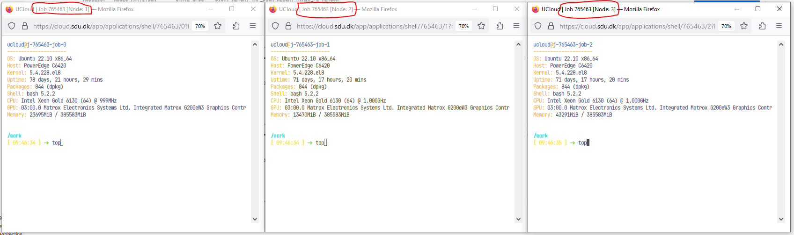

## Example using Ray 

In terminal run:


```R
python slurm-launch.py --script slurm-template_ray.sh --exp-name SlurmTest --command "python /work/SLURM_scripts/SklearnRay.py" --num-nodes 3

# Output

Starting to submit job!
Job submitted! Script file is at: <SlurmTest_0425-1208.sh>. Log file is at: <SlurmTest_0425-1208.log>
Submitted batch job 2


```

### Open extra Terminal for three Nodes 


### Run "top" command is used to show the Linux processes.


### Observed that the work is disbrubted across all three nodes. 
This may look different for different backends (e.g. Dask). It should be noted that in this example on 8 core nodes were used. Full nodes (64 cores) will generate alot more processes.


## Output files

### The autogenerated SLURM script (SlurmTest_0425-1208.sh)


```R
#!/bin/bash
# shellcheck disable=SC2206
# THIS FILE IS GENERATED BY AUTOMATION SCRIPT! PLEASE REFER TO ORIGINAL SCRIPT!
# THIS FILE IS MODIFIED AUTOMATICALLY FROM TEMPLATE AND SHOULD BE RUNNABLE!

#SBATCH --job-name=SlurmTest_0425-1208
#SBATCH --output=SlurmTest_0425-1208.log

### This script works for any number of nodes, Ray will find and manage all resources
#SBATCH --nodes=3
#SBATCH --exclusive
### Give all resources to a single Ray task, ray can manage the resources internally
#SBATCH --ntasks-per-node=1
##SBATCH --gpus-per-task=${NUM_GPUS_PER_NODE} #De-activated by KGP 230317

# Load modules or your own conda environment here
# module load pytorch/v1.4.0-gpu
# conda activate ${CONDA_ENV}


# ===== DO NOT CHANGE THINGS HERE UNLESS YOU KNOW WHAT YOU ARE DOING =====

echo $SLURM_JOB_NODELIST

nodes=$(scontrol show hostnames "$SLURM_JOB_NODELIST") # Getting the node names

nodes_array=($nodes)
node_1=${nodes_array[0]}
ip=$(srun --nodes=1 --ntasks=1 -w "$node_1" hostname --ip-address) # making redis-address

# if we detect a space character in the head node IP, we'll
# convert it to an ipv4 address. This step is optional.
if [[ "$ip" == *" "* ]]; then
  IFS=' ' read -ra ADDR <<< "$ip"
  if [[ ${#ADDR[0]} -gt 16 ]]; then
    ip=${ADDR[1]}
  else
    ip=${ADDR[0]}
  fi
  echo "IPV6 address detected. We split the IPV4 address as $ip"
fi

port=6379
ip_head=$ip:$port
export ip_head
echo "IP Head: $ip_head"

echo "STARTING HEAD at $node_1"
srun --nodes=1 --ntasks=1 -w "$node_1" ray start --head --node-ip-address="$ip" --port=$port --block &
sleep 30

#worker_num=$((SLURM_JOB_NUM_NODES - 1)) #number of nodes other than the head node
#export NB_WORKERS=$((${SLURM_JOB_NUM_NODES-1})) #number of nodes other than the head node
#echo ${NB_WORKERS}

export NB_WORKERS=$((SLURM_JOB_NUM_NODES - 1)) #number of nodes other than the head node
echo "STARTING ${NB_WORKERS} WORKERS"
for ((i = 1; i <= NB_WORKERS; i++)); do
  node_i=${nodes_array[$i]}
  echo "STARTING WORKER $i at $node_i"
  srun --nodes=1 --ntasks=1 -w "$node_i" ray start --address "$ip_head" --block &
  sleep 5
done

# ===== Call your code below =====
echo "RUNNING CODE: python /work/data/SklearnRay.py"
python /work/data/SklearnRay.py
```

### Autogenerated log file (SlurmTest_0425-1208.log)


```R
node[0-2]
IPV6 address detected. We split the IPV4 address as 10.42.47.86
IP Head: 10.42.47.86:6379
STARTING HEAD at node0
2023-04-25 12:08:40,054 WARNING utils.py:652 -- Ray currently does not support initializing Raywith fractional cpus. Your num_cpus will be truncated from 7.5 to 7.
STARTING 2 WORKERS
STARTING WORKER 1 at node1
2023-04-25 12:08:38,026 INFO usage_lib.py:461 -- Usage stats collection is enabled by default without user confirmation because this terminal is detected to be non-interactive. To disable this, add `--disable-usage-stats` to the command that starts the cluster, or run the following command: `ray disable-usage-stats` before starting the cluster. See https://docs.ray.io/en/master/cluster/usage-stats.html for more details.
2023-04-25 12:08:38,026 INFO scripts.py:710 -- Local node IP: 10.42.47.86
2023-04-25 12:08:41,222 SUCC scripts.py:747 -- --------------------
2023-04-25 12:08:41,222 SUCC scripts.py:748 -- Ray runtime started.
2023-04-25 12:08:41,223 SUCC scripts.py:749 -- --------------------
2023-04-25 12:08:41,223 INFO scripts.py:751 -- Next steps
2023-04-25 12:08:41,223 INFO scripts.py:752 -- To connect to this Ray runtime from another node, run
2023-04-25 12:08:41,223 INFO scripts.py:755 --   ray start --address='10.42.47.86:6379'
2023-04-25 12:08:41,223 INFO scripts.py:771 -- Alternatively, use the following Python code:
2023-04-25 12:08:41,223 INFO scripts.py:773 -- import ray
2023-04-25 12:08:41,223 INFO scripts.py:777 -- ray.init(address='auto', _node_ip_address='10.42.47.86')
2023-04-25 12:08:41,223 INFO scripts.py:790 -- To see the status of the cluster, use
2023-04-25 12:08:41,223 INFO scripts.py:791 --   ray status
2023-04-25 12:08:41,223 INFO scripts.py:801 -- If connection fails, check your firewall settings and network configuration.
2023-04-25 12:08:41,224 INFO scripts.py:809 -- To terminate the Ray runtime, run
2023-04-25 12:08:41,224 INFO scripts.py:810 --   ray stop
2023-04-25 12:08:41,224 INFO scripts.py:891 -- --block
2023-04-25 12:08:41,224 INFO scripts.py:892 -- This command will now block forever until terminated by a signal.
2023-04-25 12:08:41,224 INFO scripts.py:895 -- Running subprocesses are monitored and a message will be printed if any of them terminate unexpectedly. Subprocesses exit with SIGTERM will be treated as graceful, thus NOT reported.
STARTING WORKER 2 at node2
2023-04-25 12:08:48,882 WARNING utils.py:652 -- Ray currently does not support initializing Raywith fractional cpus. Your num_cpus will be truncated from 7.5 to 7.
[2023-04-25 12:08:48,933 I 2244 2244] global_state_accessor.cc:356: This node has an IP address of 10.42.28.36, while we can not find the matched Raylet address. This maybe come from when you connect the Ray cluster with a different IP address or connect a container.
2023-04-25 12:08:48,859 INFO scripts.py:866 -- Local node IP: 10.42.28.36
2023-04-25 12:08:48,935 SUCC scripts.py:878 -- --------------------
2023-04-25 12:08:48,935 SUCC scripts.py:879 -- Ray runtime started.
2023-04-25 12:08:48,935 SUCC scripts.py:880 -- --------------------
2023-04-25 12:08:48,935 INFO scripts.py:882 -- To terminate the Ray runtime, run
2023-04-25 12:08:48,935 INFO scripts.py:883 --   ray stop
2023-04-25 12:08:48,935 INFO scripts.py:891 -- --block
2023-04-25 12:08:48,935 INFO scripts.py:892 -- This command will now block forever until terminated by a signal.
2023-04-25 12:08:48,935 INFO scripts.py:895 -- Running subprocesses are monitored and a message will be printed if any of them terminate unexpectedly. Subprocesses exit with SIGTERM will be treated as graceful, thus NOT reported.
RUNNING CODE: python /work/data/SklearnRay.py
2023-04-25 12:08:54,215 WARNING utils.py:652 -- Ray currently does not support initializing Raywith fractional cpus. Your num_cpus will be truncated from 7.5 to 7.
[2023-04-25 12:08:54,271 I 956 956] global_state_accessor.cc:356: This node has an IP address of 10.42.34.213, while we can not find the matched Raylet address. This maybe come from when you connect the Ray cluster with a different IP address or connect a container.
2023-04-25 12:08:54,135 INFO scripts.py:866 -- Local node IP: 10.42.34.213
2023-04-25 12:08:54,274 SUCC scripts.py:878 -- --------------------
2023-04-25 12:08:54,275 SUCC scripts.py:879 -- Ray runtime started.
2023-04-25 12:08:54,275 SUCC scripts.py:880 -- --------------------
2023-04-25 12:08:54,275 INFO scripts.py:882 -- To terminate the Ray runtime, run
2023-04-25 12:08:54,275 INFO scripts.py:883 --   ray stop
2023-04-25 12:08:54,275 INFO scripts.py:891 -- --block
2023-04-25 12:08:54,275 INFO scripts.py:892 -- This command will now block forever until terminated by a signal.
2023-04-25 12:08:54,275 INFO scripts.py:895 -- Running subprocesses are monitored and a message will be printed if any of them terminate unexpectedly. Subprocesses exit with SIGTERM will be treated as graceful, thus NOT reported.
2023-04-25 12:09:24,758 INFO worker.py:1364 -- Connecting to existing Ray cluster at address: 10.42.47.86:6379...
2023-04-25 12:09:24,775 INFO worker.py:1553 -- Connected to Ray cluster.
2023-04-25 12:09:25,073 WARNING pool.py:604 -- The 'context' argument is not supported using ray. Please refer to the documentation for how to control ray initialization.
Fitting 10 folds for each of 500 candidates, totalling 5000 fits
209.00055767036974
srun: Job step aborted: Waiting up to 32 seconds for job step to finish.
srun: Job step aborted: Waiting up to 32 seconds for job step to finish.
srun: Job step aborted: Waiting up to 32 seconds for job step to finish.
slurmstepd-node2: error: *** STEP 2.3 ON node2 CANCELLED AT 2023-04-25T12:12:54 ***
slurmstepd-node0: error: *** STEP 2.1 ON node0 CANCELLED AT 2023-04-25T12:12:54 ***
slurmstepd-node1: error: *** STEP 2.2 ON node1 CANCELLED AT 2023-04-25T12:12:54 ***
srun: error: node2: task 0: Exited with exit code 1
srun: error: node1: task 0: Exited with exit code 1
srun: error: node0: task 0: Exited with exit code 1
```


```R

```
