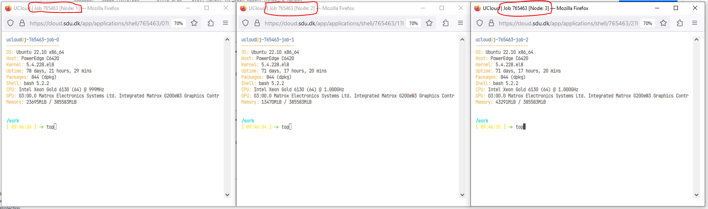

=== "UCloud Tutorial: Run Multi-node SLURM Cluster on UCloud"

    ## Launch a "Terminal App" UCloud Job

    In addition to the normal setting fill out the following options (See figure below).

    In this example launched as cluster consisting of 3 nodes with three folder added to the launch:

    - **"miniconda3"**  - contains the conda environment I want to deploy across the different nodes.
    - **"SLURM_deployment"** - contains the easy-to-use deployment scripts provided in this tutorial. 
    - **"SLURM_scripts"** - contains the user specific script and data to run on the cluster.

    In this example Conda is used for package and evironment management. Check here for more information on [Conda on UCloud]().


    


    ### When the job has started open Terminal for Node 1 

    

    Run following commands in the terminal: 

    ```R

    # activate SLURM Cluster if not activated in the step above
    init_slurm_cluster

    # List Avaliable nodes
    sinfo -N -l

    ```

    The controller node is always the first node. Called "node0" in within SLURM but called "Node 1" in the UCloud interface). All additional nodes are named sequentially. For example, a cluster consisting of three full u1-standard nodes is configured as follows:


    ```R
    NODELIST   NODES PARTITION     STATE CPUS   S:C:T MEMORY
    node0         1     CLOUD*     idle   64   1:64:1 385024
    node1         1     CLOUD*     idle   64   1:64:1 385024
    node2         1     CLOUD*     idle   64   1:64:1 385024
    ```

    But called Node 1, Node 2 and Node 3 in the UCloud interface.

    ## Acitvate Conda Environment 

    In terminal add conda environment:


    ```R
    # Running a new UCloud run the following lines in the terminal to activate Conda:
    sudo ln -s /work/miniconda3/bin/conda /usr/bin/conda

    # Init Conda:
    conda init && bash -i

    # Shows already installed environments:
    conda env list

    # Activate environment:
    conda activate myenv

    # Check which environment is in path (e.g. X = python,R..)
    which X # (e.g. X = python,R..)

    # Output should be: 
    /work/miniconda3/envs/myenv/bin/X # (e.g. X = python,R..)

    ```

    ## SLURM deployment scripts

    The SLURM deployment script ("slurm-launch.py") have been adopted from  [Ray documentation](https://docs.ray.io/en/latest/cluster/vms/user-guides/community/slurm.html#python-interface-slurm-scripts) to support the addition of other python libraries (Dask, ipyparallel) and other languages (e.g. R).

    ### slurm-launch.py

    "slurm-launch.py" auto-generates SLURM scripts and launch. slurm-launch.py uses an underlying template (e.g. "slurm-template_ray.sh" or "slurm-template_dask.sh") and fills out placeholders given user input.


    ```R

    # Change path:
    cd /work/SLURM_deployment

    # Python with Ray
    python slurm-launch.py --script slurm-template_ray.sh --exp-name SlurmTest --command "python /work/SLURM_scripts/SklearnRay.py" --num-nodes 3

    # Python with Dask
    python slurm-launch.py --script slurm-template_dask.sh --exp-name SlurmTest --command "python /work/SLURM_scripts/SklearnDask.py" --num-nodes 3 --nprocs 8 --nthreads 1

    # R with doParallel
    python slurm-launch.py --script slurm-template_R.sh --exp-name SlurmTest --command "Rscript --vanilla /work/SLURM_scripts/doParallel.r" --num-nodes 3 --nprocs 8 --nthreads 1 


    # Example of Output
    Starting to submit job!
    Job submitted! Script file is at: <SlurmTest_0425-1208.sh>. Log file is at: <SlurmTest_0425-1208.log>
    Submitted batch job 2

    ```

    ### Addditionel options


    ```R

    --exp-name          # The experiment name. Will generate {exp-name}_{date}-{time}.sh and {exp-name}_{date}-{time}.log.
    --command           # The command you wish to run. For example: rllib train XXX or python XXX.py.
    --node (-w)         # The specific nodes you wish to use, in the same form as the output of sinfo. Nodes are automatically assigned if not specified.
    --num-nodes (-n)    # The number of nodes you wish to use. Default: 1.
    --partition (-p):   # The partition you wish to use. Default: “”, will use user’s default partition.
    --load-env:         # The command to setup your environment. For example: module load cuda/10.1. Default: “”.
    --nprocs: 
    --nthreads:


    ```

    ### Open extra terminal for the three nodes 
    

    ### Run "top" command is used to show the Linux processes.
    

    ### Observed that the work is distibuted across all three nodes. 
    This may look different for different frameworks (e.g. Ray, Dask, R). It should be noted that in this example on 8 core nodes were used. Full nodes (64 cores) will generate alot more processes.

    

=== "Launch File (slurm-launch.py)"
    ```
    --8<-- "docs\UCloud_SlurmCluster\SLURM_deployment\slurm-launch.py"
    ```
=== "Ray (Python)"
    === "slurm-template_ray.sh"
        ```
        --8<-- "docs\UCloud_SlurmCluster\SLURM_deployment\slurm-template_ray.sh"
        ```
    === "SklearnRay.py"
        ```
        --8<-- "docs\UCloud_SlurmCluster\SLURM_scripts\SklearnRay.py"
        ```
=== "Dask (Python)"
    === "slurm-template_dask.sh"
        ```
        --8<-- "docs\UCloud_SlurmCluster\SLURM_deployment\slurm-template_dask.sh"
        ```
    === "SklearnDask.py"
        ```
        --8<-- "docs\UCloud_SlurmCluster\SLURM_scripts\SklearnDask.py"
        ```
=== "doParallel (R)"
    === "slurm-template_R.sh"
        ```
        --8<-- "docs\UCloud_SlurmCluster\SLURM_deployment\slurm-template_R.sh"
        ```
    === "doParallel.r"
        ```
        --8<-- "docs\UCloud_SlurmCluster\SLURM_scripts\doParallel.r"
        ```

    === "tidyModel_RF.r"
        ```
        --8<-- "docs\UCloud_SlurmCluster\SLURM_scripts\tidyModel_RF.r"
        ```